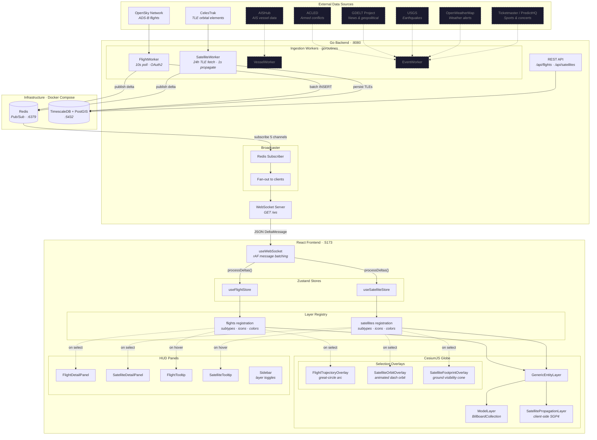
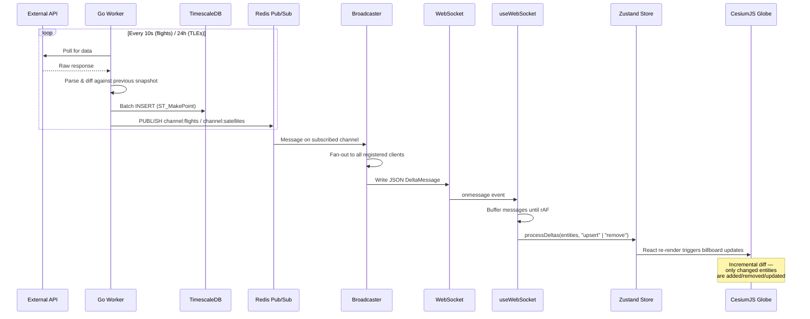
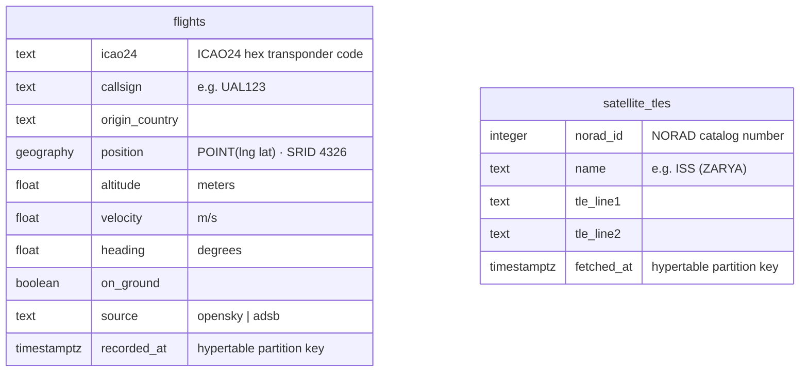
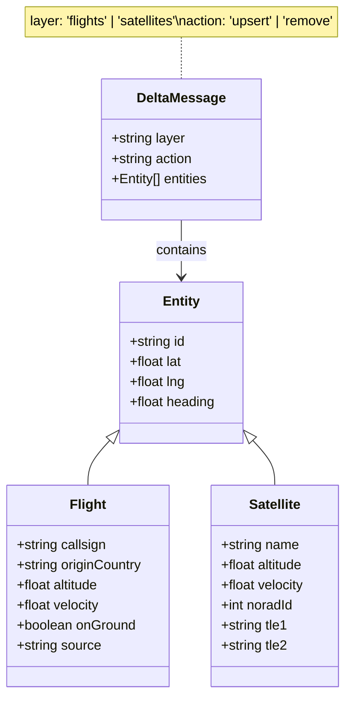
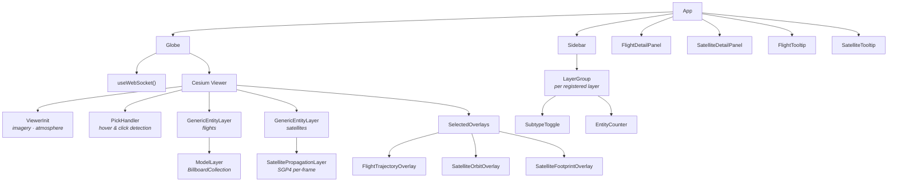
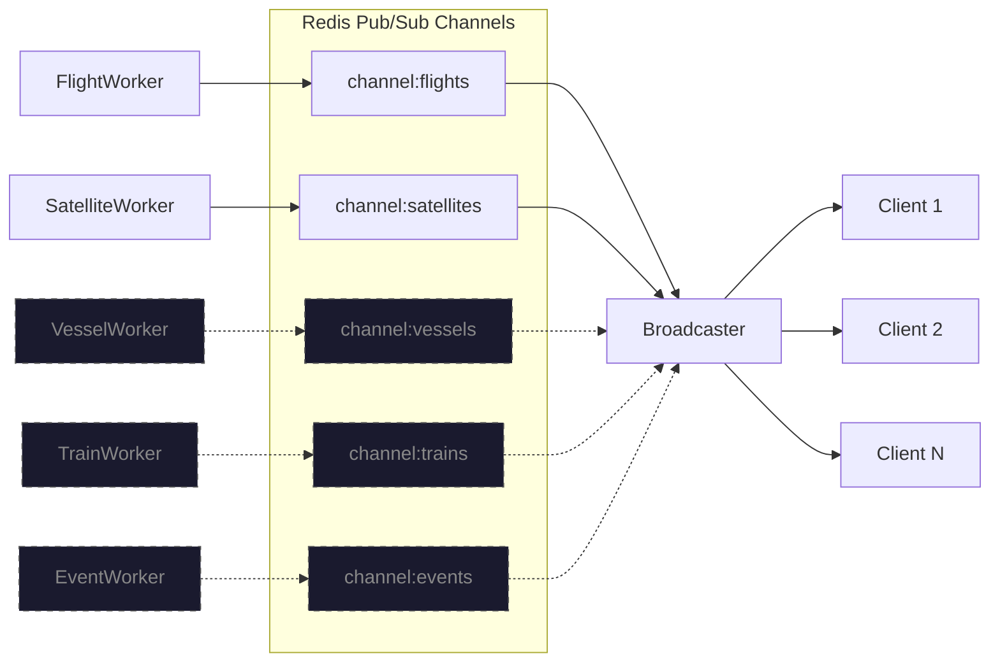

# Architecture

## System Overview

## Data Flow

## Database Schema

## WebSocket Message Format

## Frontend Component Tree

## Redis Channel Map

---

_Dashed outlines indicate planned components not yet implemented._
