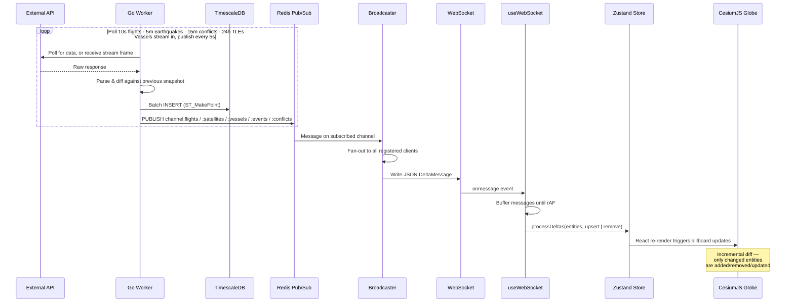
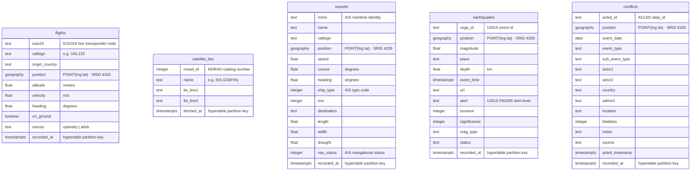
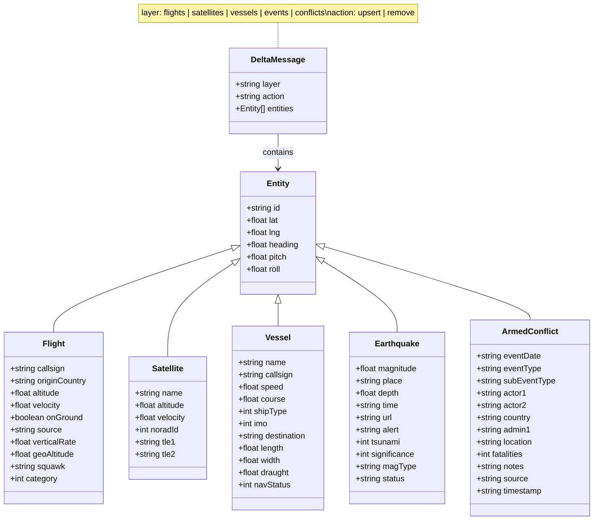
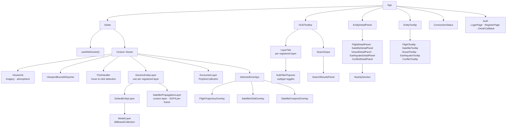
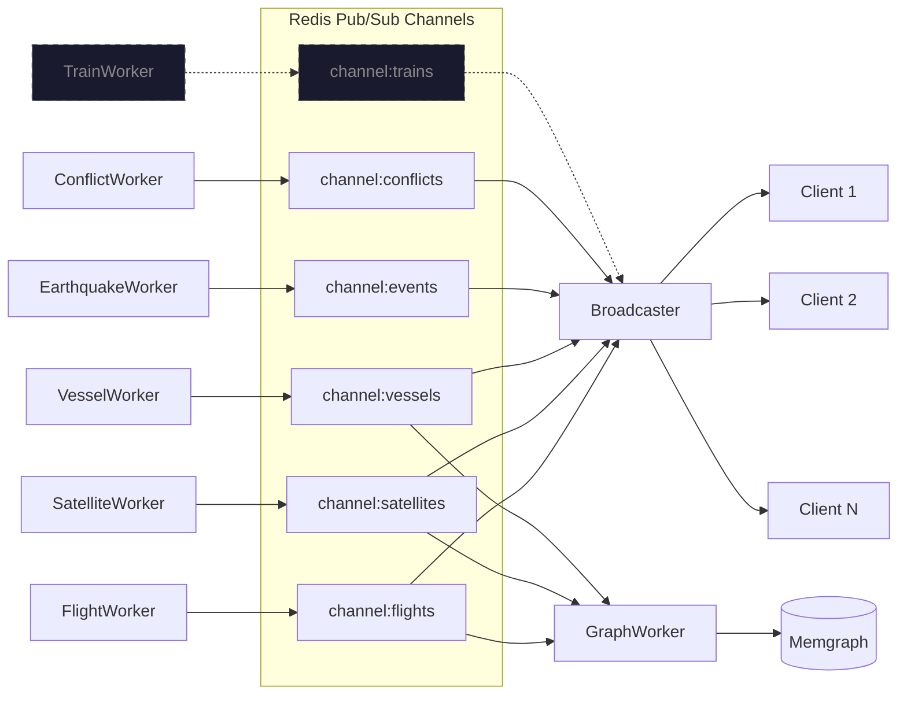
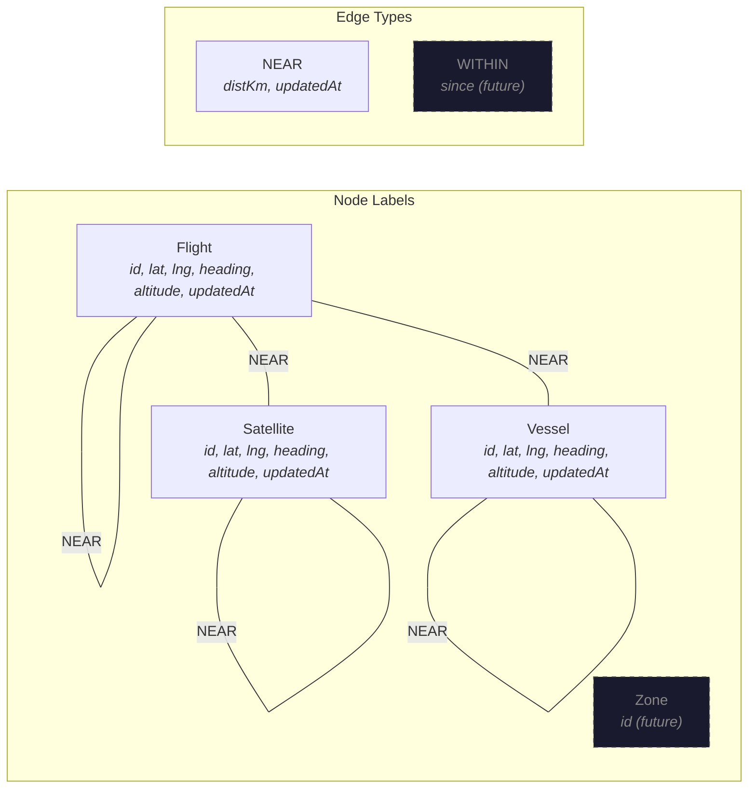

# Architecture

## System Overview

```mermaid
graph TB
  subgraph External["External Data Sources"]
    OpenSky["OpenSky Network<br/><i>ADS-B flights</i>"]
    CelesTrak["CelesTrak<br/><i>TLE orbital elements</i>"]
    AISStream["AISStream<br/><i>AIS vessel stream</i>"]
    USGS["USGS<br/><i>Earthquakes</i>"]
    ACLED["ACLED<br/><i>Armed conflicts</i>"]
    ORM["OpenRailwayMap / GTFS<br/><i>Trains</i>"]:::planned
    GDELT["GDELT Project<br/><i>News & geopolitical</i>"]:::planned
    OWM["OpenWeatherMap<br/><i>Weather alerts</i>"]:::planned
    TM["Ticketmaster / PredictHQ<br/><i>Sports & concerts</i>"]:::planned
  end

  subgraph Go["Go Backend · :8080"]
    subgraph Workers["Ingestion Workers · goroutines"]
      FW["FlightWorker<br/><i>10s poll · OAuth2</i>"]
      SW["SatelliteWorker<br/><i>24h TLE fetch · 1s propagate</i>"]
      VW["VesselWorker<br/><i>AIS stream · 5s publish · 30s persist</i>"]
      EW["EarthquakeWorker<br/><i>5m poll</i>"]
      CW["ConflictWorker<br/><i>15m poll</i>"]
      TW["TrainWorker"]:::planned
    end

    subgraph Broadcast["Broadcaster"]
      RedisSub["Redis Subscriber"]
      Fanout["Fan-out to clients"]
    end

    subgraph GraphLayer["Graph Layer"]
      GW["GraphWorker<br/><i>Redis → Memgraph</i>"]
    end

    WS["WebSocket Server<br/><i>GET /ws</i>"]
    API["REST API<br/><i>/api/flights · /api/satellites · /api/vessels<br/>/api/earthquakes · /api/conflicts<br/>/api/graph/nearby · /api/graph/encounters<br/>/api/me · authenticated</i>"]
  end

  subgraph Auth["Go Auth Service · :8081"]
    AuthAPI["Auth API<br/><i>/auth/register · /auth/login<br/>/auth/refresh · /auth/logout · /auth/me</i>"]
    OAuth["OAuth<br/><i>GitHub · Google · code exchange</i>"]
  end

  subgraph Infra["Infrastructure · Docker Compose"]
    Redis[("Redis<br/><i>Pub/Sub · :6379</i>")]
    TSDB[("TimescaleDB + PostGIS<br/><i>:5432</i>")]
    Memgraph[("Memgraph<br/><i>Graph DB · :7687</i>")]
  end

  subgraph React["React Frontend · :5173"]
    WSHook["useWebSocket<br/><i>rAF message batching</i>"]

    subgraph Stores["Zustand Stores"]
      FS["useFlightStore"]
      SS["useSatelliteStore"]
      VS["useVesselStore"]
      ES["useEarthquakeStore"]
      CS["useConflictStore"]
      AS["useAuthStore"]
    end

    subgraph Registry["Layer Registry"]
      FR["flights registration<br/><i>subtypes · icons · colors</i>"]
      SR["satellites registration<br/><i>custom SGP4 layer</i>"]
      VR["vessels registration"]
      ER["events registration<br/><i>earthquakes</i>"]
      CR["conflicts registration"]
    end

    subgraph Globe["CesiumJS Globe"]
      GEL["GenericEntityLayer<br/><i>one per registration</i>"]
      ML["ModelLayer<br/><i>BillboardCollection</i>"]
      SPL["SatellitePropagationLayer<br/><i>client-side SGP4</i>"]
      EL["EncounterLayer<br/><i>PolylineCollection</i>"]

      subgraph Overlays["Selection Overlays"]
        FTO["FlightTrajectoryOverlay<br/><i>great-circle arc</i>"]
        SOO["SatelliteOrbitOverlay<br/><i>animated dash orbit</i>"]
        SFO["SatelliteFootprintOverlay<br/><i>ground visibility cone</i>"]
      end
    end

    subgraph HUD["HUD Panels"]
      EDP["EntityDetailPanel<br/><i>dispatches to per-layer panel</i>"]
      ETT["EntityTooltip<br/><i>dispatches to per-layer tooltip</i>"]
      NS["NearbySection<br/><i>graph proximity</i>"]
      Toolbar["HUDToolbar<br/><i>layer tabs · search · sub-filters</i>"]
      Conn["ConnectionStatus"]
    end
  end

  %% External → Workers
  OpenSky --> FW
  CelesTrak --> SW
  AISStream --> VW
  USGS --> EW
  ACLED --> CW
  ORM -.-> TW
  GDELT -.-> CW
  OWM -.-> EW
  TM -.-> EW

  %% Workers → Redis & DB
  FW -- "publish delta" --> Redis
  SW -- "publish delta" --> Redis
  VW -- "publish delta" --> Redis
  EW -- "publish delta" --> Redis
  CW -- "publish delta" --> Redis
  FW -- "batch INSERT" --> TSDB
  SW -- "persist TLEs" --> TSDB
  VW -- "batch INSERT" --> TSDB
  EW -- "batch INSERT" --> TSDB
  CW -- "batch INSERT" --> TSDB

  %% Redis → Broadcaster → WebSocket
  Redis -- "subscribe 6 channels" --> RedisSub
  RedisSub --> Fanout
  Fanout --> WS

  %% Redis → GraphWorker → Memgraph
  Redis -- "subscribe 3 channels" --> GW
  GW -- "MERGE nodes + NEAR edges" --> Memgraph

  %% REST API → DB & Graph
  API --> TSDB
  API -- "proximity queries" --> Memgraph

  %% Auth service
  AuthAPI --> TSDB
  OAuth --> TSDB
  AS -- "login · refresh" --> AuthAPI
  AS -- "OAuth code exchange" --> OAuth
  AS -- "Bearer JWT" --> API
  AS -- "JWT" --> WS

  %% WebSocket → Frontend
  WS -- "JSON DeltaMessage" --> WSHook
  WSHook -- "processDeltas()" --> FS
  WSHook -- "processDeltas()" --> SS
  WSHook -- "processDeltas()" --> VS
  WSHook -- "processDeltas()" --> ES
  WSHook -- "processDeltas()" --> CS

  %% Stores → Registry → Globe
  FS --> FR
  SS --> SR
  VS --> VR
  ES --> ER
  CS --> CR
  FR --> GEL
  SR --> GEL
  VR --> GEL
  ER --> GEL
  CR --> GEL
  GEL --> ML
  GEL --> SPL

  %% Selection → Overlays
  FR -. "on select" .-> FTO
  SR -. "on select" .-> SOO
  SR -. "on select" .-> SFO

  %% Registry → HUD
  FR -. "on select" .-> EDP
  SR -. "on select" .-> EDP
  VR -. "on select" .-> EDP
  ER -. "on select" .-> EDP
  CR -. "on select" .-> EDP
  FR -. "on hover" .-> ETT
  SR -. "on hover" .-> ETT
  VR -. "on hover" .-> ETT
  ER -. "on hover" .-> ETT
  CR -. "on hover" .-> ETT

  %% NearbySection in detail panels
  EDP --> NS

  %% EncounterLayer polls graph API
  EL -. "GET /api/graph/encounters<br/>every 5s" .-> API

  classDef planned fill:#1a1a2e,stroke:#555,stroke-dasharray:5 5,color:#888
```

## Data Flow

```mermaid
sequenceDiagram
  participant API as External API
  participant Worker as Go Worker
  participant DB as TimescaleDB
  participant Redis as Redis Pub/Sub
  participant BC as Broadcaster
  participant WS as WebSocket
  participant Hook as useWebSocket
  participant Store as Zustand Store
  participant Globe as CesiumJS Globe

  loop Poll 10s flights · 5m earthquakes · 15m conflicts · 24h TLEs<br/>Vessels stream in, publish every 5s
    Worker->>API: Poll for data, or receive stream frame
    API-->>Worker: Raw response
    Worker->>Worker: Parse & diff against previous snapshot
    Worker->>DB: Batch INSERT (ST_MakePoint)
    Worker->>Redis: PUBLISH channel:flights / :satellites / :vessels / :events / :conflicts
  end

  Redis->>BC: Message on subscribed channel
  BC->>BC: Fan-out to all registered clients
  BC->>WS: Write JSON DeltaMessage

  WS->>Hook: onmessage event
  Hook->>Hook: Buffer messages until rAF
  Hook->>Store: processDeltas(entities, upsert | remove)
  Store->>Globe: React re-render triggers billboard updates

  Note over Globe: Incremental diff —<br/>only changed entities<br/>are added/removed/updated
```

## Database Schema

Every table below is a TimescaleDB hypertable partitioned on `recorded_at`, and
every position column is a PostGIS `GEOGRAPHY(POINT, 4326)`.

```mermaid
erDiagram
  flights {
    text icao24 "ICAO24 hex transponder code"
    text callsign "e.g. UAL123"
    text origin_country
    geography position "POINT(lng lat) · SRID 4326"
    float altitude "meters"
    float velocity "m/s"
    float heading "degrees"
    boolean on_ground
    text source "opensky | adsb"
    timestamptz recorded_at "hypertable partition key"
  }

  satellite_tles {
    integer norad_id "NORAD catalog number"
    text name "e.g. ISS (ZARYA)"
    text tle_line1
    text tle_line2
    timestamptz fetched_at "hypertable partition key"
  }

  vessels {
    text mmsi "AIS maritime identity"
    text name
    text callsign
    geography position "POINT(lng lat) · SRID 4326"
    float speed
    float course "degrees"
    float heading "degrees"
    integer ship_type "AIS type code"
    integer imo
    text destination
    float length
    float width
    float draught
    integer nav_status "AIS navigational status"
    timestamptz recorded_at "hypertable partition key"
  }

  earthquakes {
    text usgs_id "USGS event id"
    geography position "POINT(lng lat) · SRID 4326"
    float magnitude
    text place
    float depth "km"
    timestamptz event_time
    text url
    text alert "USGS PAGER alert level"
    integer tsunami
    integer significance
    text mag_type
    text status
    timestamptz recorded_at "hypertable partition key"
  }

  conflicts {
    text acled_id "ACLED data_id"
    geography position "POINT(lng lat) · SRID 4326"
    date event_date
    text event_type
    text sub_event_type
    text actor1
    text actor2
    text country
    text admin1
    text location
    integer fatalities
    text notes
    text source
    timestamptz acled_timestamp
    timestamptz recorded_at "hypertable partition key"
  }
```

The auth service owns its own migrations against the same database:
`users`, `refresh_tokens`, and `oauth_codes`.

## WebSocket Message Format

```mermaid
classDiagram
  class DeltaMessage {
    +string layer
    +string action
    +Entity[] entities
  }
  class Entity {
    +string id
    +float lat
    +float lng
    +float heading
    +float pitch
    +float roll
  }
  class Flight {
    +string callsign
    +string originCountry
    +float altitude
    +float velocity
    +boolean onGround
    +string source
    +float verticalRate
    +float geoAltitude
    +string squawk
    +int category
  }
  class Satellite {
    +string name
    +float altitude
    +float velocity
    +int noradId
    +string tle1
    +string tle2
  }
  class Vessel {
    +string name
    +string callsign
    +float speed
    +float course
    +int shipType
    +int imo
    +string destination
    +float length
    +float width
    +float draught
    +int navStatus
  }
  class Earthquake {
    +float magnitude
    +string place
    +float depth
    +string time
    +string url
    +string alert
    +int tsunami
    +int significance
    +string magType
    +string status
  }
  class ArmedConflict {
    +string eventDate
    +string eventType
    +string subEventType
    +string actor1
    +string actor2
    +string country
    +string admin1
    +string location
    +int fatalities
    +string notes
    +string source
    +string timestamp
  }

  DeltaMessage --> Entity : contains
  Entity <|-- Flight
  Entity <|-- Satellite
  Entity <|-- Vessel
  Entity <|-- Earthquake
  Entity <|-- ArmedConflict

  note for DeltaMessage "layer: flights | satellites | vessels | events | conflicts\naction: upsert | remove"
```

## Frontend Component Tree

```mermaid
graph TD
  App["App"]
  Globe["Globe"]
  WSHook["useWebSocket()"]
  Viewer["Cesium Viewer"]
  ViewerInit["ViewerInit<br/><i>imagery · atmosphere</i>"]
  VBR["ViewportBoundsReporter"]
  PickHandler["PickHandler<br/><i>hover & click detection</i>"]

  GEL["GenericEntityLayer<br/><i>one per registered layer</i>"]
  DEL["DefaultEntityLayer"]
  ML["ModelLayer<br/><i>BillboardCollection</i>"]
  SPL["SatellitePropagationLayer<br/><i>custom layer · SGP4 per-frame</i>"]
  EL2["EncounterLayer<br/><i>PolylineCollection</i>"]

  SelOverlays["SelectedOverlays"]
  FTO["FlightTrajectoryOverlay"]
  SOO["SatelliteOrbitOverlay"]
  SFO["SatelliteFootprintOverlay"]

  Toolbar["HUDToolbar"]
  LayerTab["LayerTab<br/><i>per registered layer</i>"]
  SubFilter["SubFilterPopover<br/><i>subtype toggles</i>"]
  Search["SearchInput"]
  SearchRes["SearchResultsPanel"]

  EDP["EntityDetailPanel"]
  PerLayerPanel["FlightDetailPanel · SatelliteDetailPanel<br/>VesselDetailPanel · EarthquakeDetailPanel<br/>ConflictDetailPanel"]
  ETT["EntityTooltip"]
  PerLayerTip["FlightTooltip · SatelliteTooltip<br/>VesselTooltip · EarthquakeTooltip<br/>ConflictTooltip"]
  NS2["NearbySection"]
  Conn["ConnectionStatus"]
  AuthUI["Auth<br/><i>LoginPage · RegisterPage · OAuthCallback</i>"]

  App --> Globe
  App --> Toolbar
  App --> ETT
  App --> EDP
  App --> Conn
  App --> AuthUI

  Globe --> WSHook
  Globe --> Viewer
  Viewer --> ViewerInit
  Viewer --> VBR
  Viewer --> PickHandler
  Viewer --> GEL
  Viewer --> EL2
  Viewer --> SelOverlays

  GEL --> DEL
  GEL --> SPL
  DEL --> ML

  SelOverlays --> FTO
  SelOverlays --> SOO
  SelOverlays --> SFO

  EDP --> PerLayerPanel
  PerLayerPanel --> NS2
  ETT --> PerLayerTip

  Toolbar --> LayerTab
  Toolbar --> Search
  Search --> SearchRes
  LayerTab --> SubFilter
```

`GenericEntityLayer` renders a registration's `customLayer` when it declares one
— satellites use `SatellitePropagationLayer` — and otherwise falls back to
`DefaultEntityLayer` → `ModelLayer`. `EntityDetailPanel` and `EntityTooltip`
resolve the concrete component from the layer registry, so adding a layer
requires no change in `App`.

## Redis Channel Map

```mermaid
graph LR
  subgraph Channels["Redis Pub/Sub Channels"]
    CF["channel:flights"]
    CS["channel:satellites"]
    CV["channel:vessels"]
    CE["channel:events"]
    CC["channel:conflicts"]
    CT["channel:trains"]:::planned
  end

  FW["FlightWorker"] --> CF
  SW["SatelliteWorker"] --> CS
  VW["VesselWorker"] --> CV
  EW["EarthquakeWorker"] --> CE
  CW["ConflictWorker"] --> CC
  TW["TrainWorker"]:::planned -.-> CT

  CF --> BC["Broadcaster"]
  CS --> BC
  CV --> BC
  CE --> BC
  CC --> BC
  CT -.-> BC

  CF --> GW2["GraphWorker"]
  CS --> GW2
  CV --> GW2

  BC --> C1["Client 1"]
  BC --> C2["Client 2"]
  BC --> CN["Client N"]
  GW2 --> MG[("Memgraph")]

  classDef planned fill:#1a1a2e,stroke:#555,stroke-dasharray:5 5,color:#888
```

The broadcaster subscribes to all six channels — `channel:trains` is already
wired and simply carries no traffic until a `TrainWorker` exists. The graph
worker subscribes only to the three moving-entity channels.

## Graph Schema (Memgraph)

```mermaid
graph LR
  subgraph Nodes["Node Labels"]
    F["Flight<br/><i>id, lat, lng, heading, altitude, updatedAt</i>"]
    S["Satellite<br/><i>id, lat, lng, heading, altitude, updatedAt</i>"]
    V["Vessel<br/><i>id, lat, lng, heading, altitude, updatedAt</i>"]
    Z["Zone<br/><i>id (future)</i>"]:::planned
  end

  subgraph Edges["Edge Types"]
    NEAR["NEAR<br/><i>distKm, updatedAt</i>"]
    WITHIN["WITHIN<br/><i>since (future)</i>"]:::planned
  end

  F ---|NEAR| F
  F ---|NEAR| V
  F ---|NEAR| S
  S ---|NEAR| S
  V ---|NEAR| V

  classDef planned fill:#1a1a2e,stroke:#555,stroke-dasharray:5 5,color:#888
```

Event layers — earthquakes and conflicts — are static markers with timestamps
rather than moving entities, so they are not written to the graph.

### Proximity Thresholds

| Entity Pair           | Threshold |
| --------------------- | --------- |
| Flight ↔ Flight       | 50 km     |
| Flight ↔ Vessel       | 100 km    |
| Flight ↔ Satellite    | 500 km    |
| Satellite ↔ Satellite | 200 km    |
| Vessel ↔ Vessel       | 50 km     |

### Graph API Endpoints

| Endpoint                                                        | Description                                    |
| --------------------------------------------------------------- | ---------------------------------------------- |
| `GET /api/graph/nearby?id={entityId}&hops={1-3}`                | Entities within N hops via NEAR edges (max 50) |
| `GET /api/graph/encounters?type={flights\|satellites\|vessels}` | All active NEAR edges, optional type filter    |

---

_Dashed outlines indicate planned components not yet implemented._
